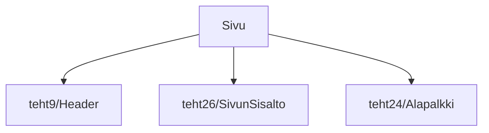

### Tehtäväsarja 6: Tehtävä 19 - `teht27`-kansio - sivu

Komponentti, joka näyttää koko sivun sisällön.

Se kokoaa siis yhteen komponentit:

* sivun yläpalkki (engl. header)
* sivun varsinainen sisältö (tehtiin edellisessä tehtävässä)
* sivun alapalkki (engl. footer)

```mermaid
graph TD;
  Sivu-->Ylapalkki[teht9/Header];
  Sivu-->SivunSisalto[teht26/SivunSisalto];
  Sivu-->Alapalkki[teht24/Alapalkki];
```

**muokattavien tiedostojen ja kansioiden nimet:** 

* tiedosto: `teht27/sivu.svelte` (kansiossa: `harjoitukset/02-javascript/01-svelte/teht27/sivu.svelte`)

Näyttää komponentit:

* `ylapalkki.svelte`
* `sivun-sisalto.svelte`
* `alapalkki.svelte`

Mieti, tarvitseeko komponentti omia html-elementtejä.
