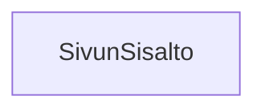

### `teht26`-kansio - sivun sisältö




**palautettavien tiedostojen ja kansioiden nimet:** 

* tiedosto: `teht26/sivun-sisalto.svelte` (kansiossa: `harjoitukset/02-javascript/01-svelte/teht26/sivun-sisalto.svelte`)

Näyttää sivun varsinaisen sisällön, siis valkoisella taustalla olevan osuuden ylä- ja alapalkin välissä.

Tällä kertaa riittää, että sivu näyttää ruudulla tekstin "Tästä löytyy sivun varsinainen sisältö."

Muista keskittää teksti tyyleillä, 
ja lisätä komponentille riittävästi korkeutta,
jotta se näyttää oikealta sivun sisällöltä.

## Toteutus: `main`-elementti

Käytä tässä komponentissa `main`-elementtiä.

`main`-elementti kertoo semanttisesti,
että se sisältää sivun keskeisen sisällön.

```svelte
<main>
    [Tämä osio jätetty tarkoituksella tyhjäksi.]
</main>
```

## Toteutus: tilan varaaminen

Sivun sisällön pitäisi venyä käyttämään kaikki tyhjä vertikaalinen tila, jota sivulta löytyy.

Sen yläpuolelta löytyy sivun yläpalkki, ja alapuolelta alapalkki. 
Jos vertikaalista tilaa jää, 
haluamme tämän komponentin käyttävän siis kaiken ylimääräisen vertikaalisen tilan.

Tämä onnistuu taas käyttämällä css-sääntöä `flex: 1 1 auto;`:

_`teht26/sivun-sisalto.svelte`:_

```svelte
<main>
    [Tämä osio jätetty tarkoituksella tyhjäksi.]
</main>

<style>
    main {
        flex: 1 1 auto;
        display: flex;

        /* lisää lisäksi seuraavat tyylit: */
        flex-direction: row;
        justify-content: center;
        align-items: center;
        min-height: 300px;
        background-color: black;
        color: white;
    }
</style>
```
