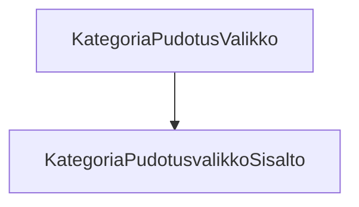

# Tehtäväsarja 6: Lisätehtävä 20 - `teht25`-kansio - pudotusvalikko kategorioille

**Tämä on vähän muita vaikeampi tehtävä, jonka voit halutessasi tehdä.**

`teht25`-kansion komponentit vastaavat yläpalkin kategorioiden toiminnallisuudesta,
jossa näytämme lisätietonäkymän, kun käyttäjä vie hiiren kategorian yläpuolelle.

Tässä tehtävässä määritämme näille komponenteille tarvittavan html-rakenteen ja komponenttien tarvitsemat propsit.

Tyylittelemme tämän komponentin toimivaksi, hover-toiminnallisuuksineen, tehtäväsarja 7:n lopusta löytyvässä lisätehtävässä.



**muokattavien tiedostojen ja kansioiden nimet:**

* tiedosto: `teht25/kategoria-pudotusvalikko.svelte` (kansiossa: `harjoitukset/02-javascript/01-svelte/teht25/kategoria-pudotusvalikko.svelte`)
* tiedosto: `teht25/kategoria-pudotusvalikko-sisalto.svelte` (kansiossa: `harjoitukset/02-javascript/01-svelte/teht25/kategoria-pudotusvalikko-sisalto.svelte`)

Tässä tehtävässä luomme yläpalkin/headerin alarivin kategoria-napeille pudotusvalikon. Siis sen referenssisivun valkoisen osion, joka tulee näkyviin, kun yksittäistä kategoriaa hoveroidaan.

Pudotusvalikon luonnista vastaa `kategoria-pudotusvalikko.svelte`, kun taas sen sisällöstä vastaa `kategoria-pudotusvalikko-sisalto.svelte`-komponentti.
Myöhemmin muutamme sisällöstä vastaavan komponentin monimutkaisemmaksi.

## `kategoria-pudotusvalikko.svelte`-komponentti:

### propsit:

`teht25/kategoria-pudotusvalikko.svelte`-komponentti saa parametrit:

* `kategoria` - [merkkijono] kategorian nimi
* `children` - kategorian nappi

### Toteutus

Komponentti lukee `teht25/kategoria-pudotusvalikko-sisalto.svelte`-komponentin ja ottaa propsit vastaan:

`teht25/kategoria-pudotusvalikko.svelte`:

```svelte
<script>
  import KategoriaPudotusvalikkoSisalto from "./kategoria-pudotusvalikko-sisalto.svelte";

  let { kategoria, children } = $props(); 
</script>
```

Ja näyttää ne, vaikka seuraavasti:

`teht25/kategoria-pudotusvalikko.svelte`:

```svelte
<!-- yhteinen div komponentin rajoiksi -->
<div class="kategoria-pudotusvalikko">

  <!-- div, johon asetetaan nappi, joka saatiin children -->
  <div class="kategoria-pudotusvalikko__nappi">
    {@render children?.()}
  </div>

  <!-- div, jossa näytetään pudotusvalikon avautuva sisältö, siis se valkoinen iso alue -->
  <div class="kategoria-pudotusvalikko__pudotettava">
    <KategoriaPudotusvalikkoSisalto kategoria={kategoria} />
  </div>
</div>
```

Jos et muista miten `children`-propsia käytettiin, voit tarkistaa tämän tehtäväsarja 4:stä.

Huomaa, että komponentti siis antaa `kategoria`-propin edelleen lapsenaan näyttämälleen `kategoria-pudotusvalikko-sisalto.svelte`-komponentille.

## `kategoria-pudotusvalikko-sisalto.svelte`-komponentti:

Näyttää tilanvaraajatekstin "kategorian pudotusvalikon teksti".

### propsit:

`teht25/kategoria-pudotusvalikko.svelte`-komponentti saa parametrit:

* `kategoria` - teksti 

Emme tule käyttämään tätä `kategoria`-propsia tässä komponentissa, mutta voit halutessasi, lisätehtävän lisätehtävänä, sen avulla vaihtaa näytettyä sisältöä.

### Toteutus:

Komponentti ottaa propsit vastaan:

`teht15/yhteystieto.svelte`:

```svelte
<script>
  let { kategoria } = $props(); 

  let teksti = "[Kategorian pudotusvalikon teksti]";
</script>
```

Ja näyttää sisällön, vaikka seuraavasti:

`teht15/yhteystieto.svelte`:

```svelte
<div>{teksti}</div>
```

### Käyttö:

Lisää vielä lopuksi tämä pudotusvalikko jokaiselle kategoria-napille, `teht07/kategoria.svelte`-komponenttiin.

Kategoria-nappiin lisäyksen kriteerit:

* luo kategoria-napille uusi ylätason div, jonka lapsena on aiempi kategoria-napin sisältö, sekä uusi pudotusvalikko, sisältöineen,
* pudotusvalikko sisältöineen on normaalisti näkymätön,
* kun pudotusvalikon päällä pidetään hiirtä, tulee valikko näkyväksi,
* kun hiiri siirretään pudotusvalikon sisälle, pudotusvalikko säilyy edelleen näkyvänä,
* pudotusvalikon näytöstä vastaava logiikka perustuu pelkkään css:ään.

