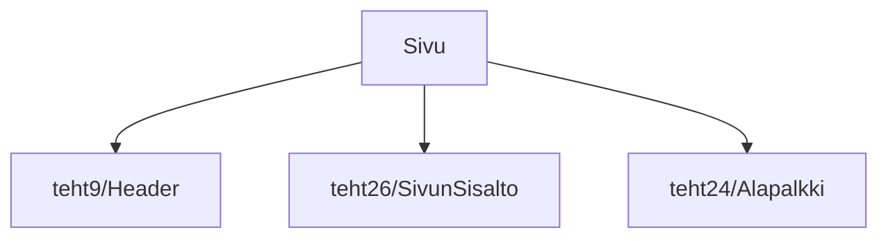

### `teht27`-kansio - sivu

Komponentti, joka näyttää koko sivun sisällön.

Se kokoaa siis yhteen komponentit:

* sivun yläpalkki (engl. header)
* sivun varsinainen sisältö (tehtiin edellisessä tehtävässä)
* sivun alapalkki (engl. footer)



**palautettavien tiedostojen ja kansioiden nimet:** 

* tiedosto: `teht27/sivu.svelte` (kansiossa: `harjoitukset/02-javascript/01-svelte/teht27/sivu.svelte`)

Näyttää komponentit:

* `ylapalkki.svelte`
* `sivun-sisalto.svelte`
* `alapalkki.svelte`

## Tehtävä: sivun korkeus

Määritä, että `sivu.svelte`-komponentti käyttää aina vähintään koko sivun korkeuden hyväkseen.
Emme siis halua, että sen alapuolelle jäisi tyhjää valkoista ruutua.

Tämä onnistuu helposti lisäämällä tyyli `min-height: 100vh;`:

```svelte
<div class="sivu">
    <!-- Tästä löytyy yllä määritellyt komponentit - lisää ne itse. -->
</div>

<style>
    .sivu {
        min-height: 100vh;
        /* Lisätään myös lapsikomponentit järjestymään vertikaalisesti. */
        display: flex;
        flex-direction: column;
    }
</style>
```
