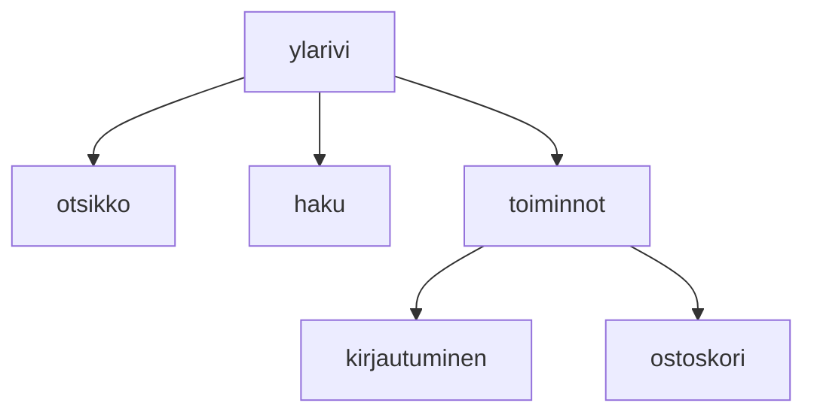

### `teht8`-kansio - verkkokaupan yläpalkin ylärivi



**palautettavien tiedostojen ja kansioiden nimet:** 

* tiedosto: `teht08/ylarivi.svelte` (kansiossa: `harjoitukset/02-javascript/01-svelte/teht08/ylarivi.svelte`)
* tiedosto: `teht08/otsikko.svelte` (kansiossa: `harjoitukset/02-javascript/01-svelte/teht08/otsikko.svelte`)
* tiedosto: `teht08/haku.svelte` (kansiossa: `harjoitukset/02-javascript/01-svelte/teht08/haku.svelte`)
* tiedosto: `teht08/toiminnot.svelte` (kansiossa: `harjoitukset/02-javascript/01-svelte/teht08/toiminnot.svelte`)
* tiedosto: `teht08/kirjautuminen.svelte` (kansiossa: `harjoitukset/02-javascript/01-svelte/teht08/kirjautuminen.svelte`)
* tiedosto: `teht08/ostoskori.svelte` (kansiossa: `harjoitukset/02-javascript/01-svelte/teht08/ostoskori.svelte`)

Tee seuraavaksi yläpalkin ylärivin komponentit.

Määritä komponentit sen perusteella, mitä sisältöä niistä referenssisivulta löytyy.

Komponentit järjestyvät siten, että `ylärivi.svelte` sisältää seuraavat komponentit:

* `otsikko.svelte`
* `haku.svelte`
* `toiminnot.svelte`

Vastaavasti `toiminnot.svelte` sisältää komponentit:

* `kirjautuminen.svelte`
* `ostoskori.svelte`

#### Huomautus kuvista

Kuvien osalta palvelin on tällä hetkellä konfigoroitu virheellisesti. 
Tämän takia kuvat eivät näy, jos ne laitetaan svelte-tiedostojen välittömään yhteyteen.

Tässä tehtävässä kuvia olisi tarvetta käyttää ylärivin toiminnot-komponentin alikomponenteissa, 
sekä hakupalkissa.

Jos haluat käyttää kuvia komponenteissa, 
pitää kuvat sijoittaa hakemistoon [`harjoitukset-apu/static/harjoitukset`](harjoitukset-apu/static/harjoitukset).

Tällöin polku kuvalle `joku-kuva.png` olisi `harjoitukset-apu/static/harjoitukset/joku-kuva.png`.
Kuviin viitataan svelte-komponentin sisältä polulla `/harjoitukset/<kuvan nimi>`.

Esimerkiksi edellä mainittua `joku-kuva.png` kuvaa käytettäisiin img-elementin sisällä seuraavasti:

```svelte

```

Normaalisti voisit sijoittaa kuvat suoraan `static`-kansioon,
mutta tässä tapauksessa pyrimme estämään vahingossa tapahtuvia versionhallinnan konflikteja,
luomalla `static`-kansion alle `harjoitukset`-kansion,
joka on vain opiskelijoiden käytössä.

Github classroomin ongelmana on, 
että kun classroomin päärepo on piilotettu,
niin kuin tässä tapauksessa on,
versionhallinnan konfliktien korjaaminen on mahdollista helposti vain opettajille, jotka näkevät päärepon.
Tämän takia joudumme tässä yhteydessä tekemään asiat hieman vaikeammin.
