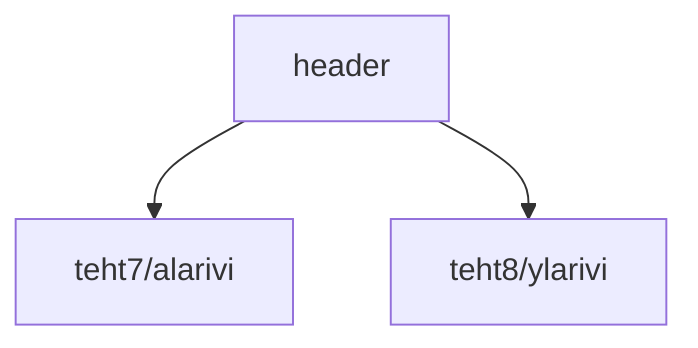

### `teht09`-kansio - verkkokaupan yläpalkki

**palautettavien tiedostojen ja kansioiden nimet:** 

* tiedosto: `teht09/header.svelte` (kansiossa: `harjoitukset/02-javascript/01-svelte/teht09/header.svelte`)

Olemme aiemmin linkittäneet tämän komponentin näyttämään yläpalkin ylä- ja alarivin.

Nyt onkin hyvä tilaisuus tyylitellä komponentti oikean näköiseksi.
