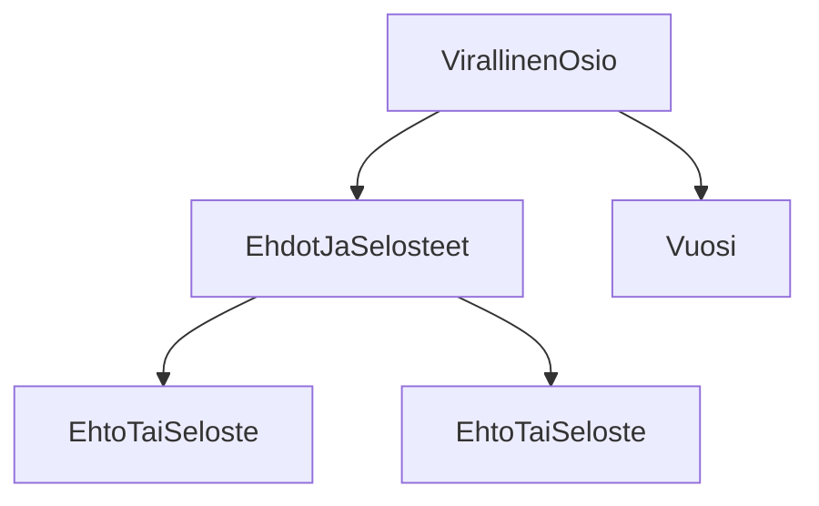

### `teht10`-kansio - verkkokaupan alapalkin virallinen-osio

Sivun alapalkin (engl. footer) musta osio, 
joka pitää sisällään virallista, lakiteknistä tietoa.



**palautettavien tiedostojen ja kansioiden nimet:**

* tiedosto: `teht10/virallinen-osio.svelte` (kansiossa: `harjoitukset/02-javascript/01-svelte/teht10/virallinen-osio.svelte`)
* tiedosto: `teht10/ehdot-ja-selosteet.svelte` (kansiossa: `harjoitukset/02-javascript/01-svelte/teht10/ehdot-ja-selosteet.svelte`)
* tiedosto: `teht10/ehto-tai-seloste.svelte` (kansiossa: `harjoitukset/02-javascript/01-svelte/teht10/ehto-tai-seloste.svelte`)
* tiedosto: `teht10/vuosi.svelte` (kansiossa: `harjoitukset/02-javascript/01-svelte/teht10/vuosi.svelte`)

Tässä tehtävässä toteutetaan sivun alapalkin virallinen osio, 
jossa listataan ehtoja ja selosteita, 
sekä kerrotaan minä vuonna sivustoa on viimeksi päivitetty.

#### Vuosi-komponentti

Aloitetaan `vuosi.svelte`-komponentista.

Sen tulee näyttää vain vuosi, jona sivua on päivitetty. 
Sivuston nimeä, tai muuta ei versiossamme tarvitse näyttää tämän komponentin sisällä.

##### Ehto tai seloste -listan alkio -komponentti

Listan alkion tulee ottaa vastaan parametrina (prop): 

* `url` - josta ehto tai seloste löytyy
* `nimi` - ehdon tai selosteen nimi, joka näytetään listassa

Komponentti siis näyttää ehdon tai selosteen nimen, 
ja sille linkkinä url:n, 
josta kyseisen virallisen tekstin voi lukea kokonaisuudessaan.

Emme siis kovakoodaa alkiokomponenttiin itseensä tietoja ehdoista tai selosteista.

Näin ollen, voimme myöhemmin helposti datana lisätä ehtoja ja selosteita lisää.

Tämän komponentin ei pitäisi tietää mitään sen tulevasta käyttöpaikasta osana listaa.
Älä siis lisää tälle komponentille `li`-elementtiä, sillä siitä vastaa tällä kertaa listakomponentti.

Lyhykäisyydessään komponentin html-rakenne voi siis näyttää esim. seuraavalta:

```html
<div>
  <a href="url">nimi</a>
</div>
```

Komponentti on oikeastaan aika yksinkertainen.

Miksi määrittelemme sen erillisessä komponentissa, 
emmekä vain suoraan listakomponentin sisällä?
Tällä tavoin voimme piilottaa komponenttiin liittyvät yksityiskohdat listakomponentilta.
Listakomponentin tehtäväksi jää tällöin vain listan jakaminen alkiokomponenteiksi.

Halutessamme myöhemmin, voisimme muuttaa alkiokomponentin hyvinkin monimutkaiseksi esitys- tai toimintatavaltaan, 
ilman, että listakomponentin tarvitsisi tietää tästä muutoksesta mitään.

Tästä tekniikasta käytetään akateemista termiä ["separation of concerns"](https://en.wikipedia.org/wiki/Separation_of_concerns) 
(suomeksi vaikka: vastuualueiden erittely). 
Se tarkoittaa, että jos yhdellä koodinpätkällä on monta toisistaan erillistä tehtävää, 
yksittäisen tehtävän ymmärtämisestä tulee helpompaa, 
jos sitä käsitellään muista erillään.
Siis esimerkiksi, jos koiran pitää haukkua ja syödä, eivätkä nämä liity toisiinsa, 
kannattaa ne myös koodissa irrottaa toisistaan, ja toteuttaa itsenäisinä toiminnallisuuksina.
Tämä on kuitenkin vähän akateemisempi käsite, eikä sitä terminä tarvitse itse osata käyttää.
Se on kuitenkin ihan hyvä tuntea, 
koska se on oikeastaan aika lailla maalaisjärkeen perustuva ajatus: 
ei tehdä asioista vaikeita, vaan pilkotaan asioita pienemmiksi.

Eli listan vastuualueisiin kuuluu siis vain listauksen tuottaminen, ei alkion näyttäminen - se on alkiokomponentin vastuulla.

##### Ehdot ja selosteet -listakomponentti

Tämä komponentti vastaa alkiokomponenttien käytöstä listan näyttämiseen, sekä listan datan määrittämisestä.

Myöhemmin saatamme muuttaa komponentin hakemaan datan jostain muualta, 
mutta ainakin näin alkuun,
kovakoodaamme listan sisältämän datan itse komponenttiin.

Tämä komponentti vastaa sekä `<ul>` että `<li>` -elementtien käytöstä.

Eli sen pitäisi näyttää suurin piirtein seuraavalta:

```svelte
<ul>
  <li>
    <EhtoTaiSeloste url="#" nimi="ehto1" />
  </li>
  <li>
    <EhtoTaiSeloste url="#" nimi="ehto2" />
  </li>
</ul>
```

Varmista referenssistä, mitkä ehtojen nimien tulisi olla.

Muista lisätä komponentille myös sopivat tyylit.

#### Virallinen-osio -komponentti kokoaa osat yhteen

Kokoa kaikki edellä toteutettu yhteen `virallinen-osio.svelte`-komponentissa.

Sen pitäisi siis näyttää komponentit:

* Ehdot ja selosteet -listakomponentti
* vuosi-komponentti

#### Muuta huomioitavaa

Määritä komponenteille itsenäisesti tyylit. Mieti, mitkä tyylit tulee määritellä minkäkin komponentin sisällä.
