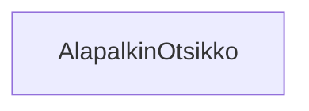

### Tehtävä 11 - verkkokaupan alapalkin otsikot

**palautettavien tiedostojen ja kansioiden nimet:** 

* tiedosto: `teht11/alapalkin-otsikko.svelte` (kansiossa: `harjoitukset/02-javascript/01-svelte/teht11/alapalkin-otsikko.svelte`)

Muokkaa `alapalkin-otsikko`-komponenttia.

Komponentti saa seuraavat parametrit (props):

* `teksti` - otsikon teksti

Yksinkertaisuudessaan komponentti näyttää siis sille annetun tekstin `h2`-elementin sisällä.
