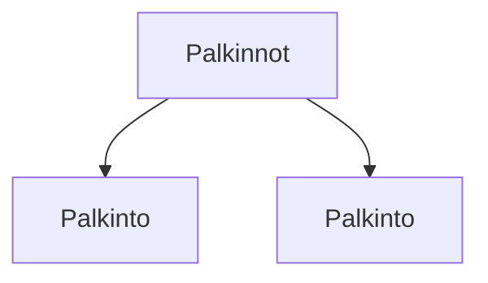

### `teht19`-kansio - palkinnot-listaus

"Palkinnot ja sertifikaatit" -otsikon alta löytyvä listaus.

**palautettavien tiedostojen ja kansioiden nimet:** 

* tiedosto: `teht19/palkinto.svelte` (kansiossa: `harjoitukset/02-javascript/01-svelte/teht19/palkinto.svelte`)
* tiedosto: `teht19/palkinnot.svelte` (kansiossa: `harjoitukset/02-javascript/01-svelte/teht19/palkinnot.svelte`)

info-sivu -komponentti saa parametrina:

* `url` - url sivulle
* `kuva` - url kuvaan

Tee komponentit taas samoin kuin edellisissä tehtävissä.
