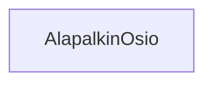

### `teht21`-kansio - alapalkin osio

**palautettavien tiedostojen ja kansioiden nimet:** 

* tiedosto: `teht21/alapalkin-osio.svelte` (kansiossa: `harjoitukset/02-javascript/01-svelte/teht21/alapalkin-osio.svelte`)

Komponentti, joka vastaa otsikon ja otsikkoa vastaavan sisällön näyttämisestä.

## Tehtävä

Olemmekin jo aiemmin toteuttaneet tämän komponentin perustoiminnallisuuden.

Tällä kertaa riittää miettiä,
millaisia tyylejä komponentti tarvitsisi