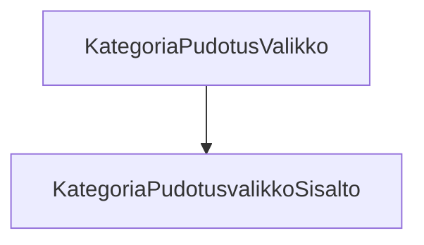

### `teht25`-kansio - pudotusvalikko kategorioille

Lisäämme tässä yläpalkin kategorioille toiminnallisuuden,
jossa näytämme lisätietonäkymän, 
kun käyttäjä vie hiiren kategorian yläpuolelle.



**palautettavien tiedostojen ja kansioiden nimet:** 

* tiedosto: `teht25/kategoria-pudotusvalikko.svelte` (kansiossa: `harjoitukset/02-javascript/01-svelte/teht25/kategoria-pudotusvalikko.svelte`)
* tiedosto: `teht25/kategoria-pudotusvalikko-sisalto.svelte` (kansiossa: `harjoitukset/02-javascript/01-svelte/teht25/kategoria-pudotusvalikko-sisalto.svelte`)

Tässä tehtävässä luomme yläpalkin/headerin alarivin kategoria-napeille pudotusvalikon. Siis sen referenssisivun valkoisen osion, joka tulee näkyviin, kun yksittäistä kategoriaa hoveroidaan.

Pudotusvalikon luonnista vastaa `kategoria-pudotusvalikko.svelte`, kun taas sen sisällöstä vastaa `kategoria-pudotusvalikko-sisalto.svelte`-komponentti.
Myöhemmin muutamme sisällöstä vastaavan komponentin monimutkaisemmaksi.

## Määrittely: `kategoria-pudotusvalikko.svelte`:

ottaa vastaan: 

* `kategoria` - [merkkijono] kategorian nimi
* `children` - kategorian nappi

Komponentti antaa `kategoria`-propin edelleen lapsenaan näyttämälleen `kategoria-pudotusvalikko-sisalto.svelte`-komponentille.

### `children`-sisältö


## Määrittely: `kategoria-pudotusvalikko-sisalto.svelte`:

* ottaa `kategoria`-propin
* näyttää tilanvaraajatekstin "kategorian pudotusvalikon teksti"

Lisää lopuksi tämä pudotusvalikko jokaiselle kategoria-napille.

Kategoria-nappiin lisäyksen kriteerit:

* luo kategoria-napille uusi ylätason div, jonka lapsena on aiempi kategoria-napin sisältö, sekä uusi pudotusvalikko, sisältöineen,
* pudotusvalikko sisältöineen on normaalisti näkymätön,
* kun pudotusvalikon päällä pidetään hiirtä, tulee valikko näkyväksi,
* kun hiiri siirretään pudotusvalikon sisälle, pudotusvalikko säilyy edelleen näkyvänä,
* pudotusvalikon näytöstä vastaava logiikka perustuu pelkkään css:ään.

#### elementin valinta suhteessa toiseen elementtiin: lapseen tai sisarukseen

Tässä tehtävässä joudut valitsemaan elementin suhteessa toiseen elementtiin, jota hoveroidaan.

Tämä onnistuu kahdella eri css-valitsimella, jotka molemmat ovat yhdistelmävalitsimia:

* vanhempi-lapsi -valitsin: `.vanhempi .lapsi`
* sisarus-valitsin: `.vanhempi-sisar ~ .nuorempi-sisarus`

Se kumpaa näistä valitsimista käytät, riippuu siitä, miten asetat komponentit (kategoria ja pudotusvalikko) suhteessa toisiinsa.

Molemmissa tapauksissa css-säännöt, jotka valitsimelle annetaan, kohdistuvat oikean puoleiseen osavalitsimeen (nuorempi sisarus, lapsi).

Sisarus-valitsimesta voit lukea lisää mdn:n dokumentaatiosta: [subsequent-sibling-combinator](https://developer.mozilla.org/en-US/docs/Web/CSS/Subsequent-sibling_combinator).

Molemmissa tapauksissa haluat valita ensimmäisen elementin silloin kun sitä hoveroidaan, ja kohdistaa säännöt oikeanpuoleiseen osavalitsimeen:

* `.vanhempi-sisarus:hover ~ .nuorempi-sisarus` - kun vanhempaa sisarusta hoveroidaan, säännöt kohdistuvat nuorempaan sisarukseen.
* `.vanhempi:hover .lapsi` - kun vanhempaa hoveroidaan, säännöt kohdistuvat lapseen.

#### Elementin piilottaminen css-säännöllä

Voit asettaa pudotusvalikon näkymättömäksi css-säännöllä:

```css
display: none;
```

ja vastaavasti asettaa näkyväksi css-säännöllä:

```css
display: flex;
```

Haluat siis asettaa pudotusvalikon:

* normaalitilassa näkymättömäksi,
* hoveroitaessa näkyväksi.

