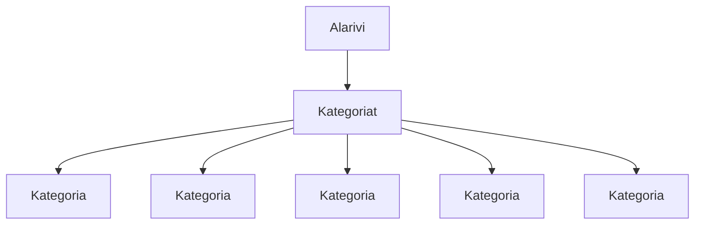

# Tehtäväsarja 7: Tehtävä 1 - `teht07`-kansio - verkkokaupan yläpalkin alarivi, eli tuotekategoriat



**muokattavien tiedostojen ja kansioiden nimet:** 

* tiedosto: `teht07/alarivi.svelte` (kansiossa: `harjoitukset/02-javascript/01-svelte/teht07/alarivi.svelte`)
* tiedosto: `teht07/kategoria.svelte` (kansiossa: `harjoitukset/02-javascript/01-svelte/teht07/kategoria.svelte`)
* tiedosto: `teht07/kategoriat.svelte` (kansiossa: `harjoitukset/02-javascript/01-svelte/teht07/kategoriat.svelte`)

Määritä yläpalkin alarivin komponenteille tyylit.

Komponenttien pitäisi näyttää tämän jälkeen pitkälti oikealta, tyyliensä osalta. Voit kuitenkin jättää viimeistelyn vielä aivan loppuun.

Taustavärin osalta voit halutessasi päättää, että tämän komponentin taustaväristä vastaa `teht09/header.svelte`-komponentti.

Jos koet, että tarvitset useammassa komponentissa samoja tyylejä, tai arvoja, esim. värejä,
muista, että voit lisätä ne `teht28/globaalit-tyylit.svelte`-komponenttiin, joka vastaa globaaleista tyyleistä.

## `teht07/kategoria.svelte`:

```svelte
<script>
  let { nimi, url } = $props(); 
</script>

<style>
  /* 
  Lisää tähän tyylit kategorialle. 
  */
</style>

<div>
  <a href={url}>{nimi}</a>
</div>
```

## `teht07/kategoriat.svelte`:

```svelte
<script>
  import Kategoria from './kategoria.svelte';
</script>

<style>
  /* 
  Lisää tähän tyylit kategoriat-komponentille. 
  */
</style>

<ul>
  <li>
    <Kategoria nimi="tietokone" url="#" />
  </li>
  <li>
    <Kategoria nimi="komponentit" url="#" />
  </li>
  <li>
    <Kategoria nimi="oheislaitteet" url="#" />
  </li>
  <li>
    <Kategoria nimi="pelaaminen" url="#" />
  </li>
  <li>
    <Kategoria nimi="sim racing" url="#" />
  </li>
  <li>
    <Kategoria nimi="verkkotuotteet" url="#" />
  </li>
  <li>
    <Kategoria nimi="tarvikkeet" url="#" />
  </li>
  <li>
    <Kategoria nimi="erikoistuotteet" url="#" />
  </li>
  <li>
    <Kategoria nimi="ohjelmistot" url="#" />
  </li>
  <li>
    <Kategoria nimi="palvelut" url="#" />
  </li>
  <li>
    <Kategoria nimi="kampanjat" url="#" />
  </li>
</ul>
```

## `teht07/alarivi.svelte`:

```svelte
<script>
  import Kategoriat from './kategoriat.svelte';
</script>

<style>
  /* 
  Lisää tähän tyylit kategoriat-komponentille. 
  */
</style>

<Kategoriat />
```
