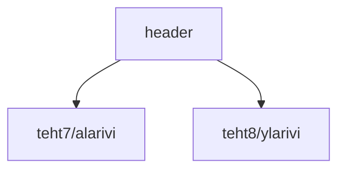

### Tehtäväsarja 7: Tehtävä 3 - `teht09`-kansio - verkkokaupan yläpalkki

**muokattavien tiedostojen ja kansioiden nimet:** 

* tiedosto: `teht09/header.svelte` (kansiossa: `harjoitukset/02-javascript/01-svelte/teht09/header.svelte`)

Tyylittele `header.svelte`-komponentti, ja sen alikomponentit pääpiirteissään oikean näköiseksi.

Jos et määrittänyt `teht07`- ja `teht08`-kansioiden komponentteja määrittämään itselleen taustaväriä, 
tämän komponentin pitäisi silloin vastata tuosta väristä.
