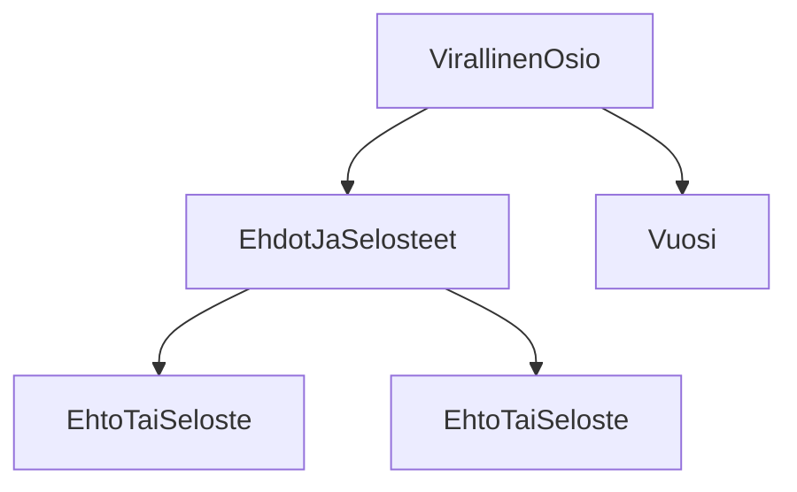

### Tehtäväsarja 7: Tehtävä 4 - `teht10`-kansio - verkkokaupan alapalkin virallinen-osio

Sivun alapalkin (engl. footer) musta osio, 
joka pitää sisällään virallista, lakiteknistä tietoa.

**palautettavien tiedostojen ja kansioiden nimet:**

* tiedosto: `teht10/virallinen-osio.svelte` (kansiossa: `harjoitukset/02-javascript/01-svelte/teht10/virallinen-osio.svelte`)
* tiedosto: `teht10/ehdot-ja-selosteet.svelte` (kansiossa: `harjoitukset/02-javascript/01-svelte/teht10/ehdot-ja-selosteet.svelte`)
* tiedosto: `teht10/ehto-tai-seloste.svelte` (kansiossa: `harjoitukset/02-javascript/01-svelte/teht10/ehto-tai-seloste.svelte`)
* tiedosto: `teht10/vuosi.svelte` (kansiossa: `harjoitukset/02-javascript/01-svelte/teht10/vuosi.svelte`)

Määritä komponenteille itsenäisesti tyylit. Mieti, mitkä tyylit tulee määritellä minkäkin komponentin sisällä.
