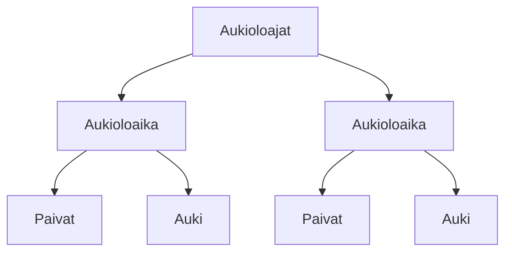

### Tehtäväsarja 7: Tehtävä 6 - `teht12`-kansio - verkkokaupan alapalkin aukioloajat

**muokattavien tiedostojen ja kansioiden nimet:** 

* tiedosto: `teht12/aukioloajat.svelte` (kansiossa: `harjoitukset/02-javascript/01-svelte/teht12/aukioloajat.svelte`)
* tiedosto: `teht12/aukioloaika.svelte` (kansiossa: `harjoitukset/02-javascript/01-svelte/teht12/aukioloaika.svelte`)
* tiedosto: `teht12/paivat.svelte` (kansiossa: `harjoitukset/02-javascript/01-svelte/teht12/paivat.svelte`)
* tiedosto: `teht12/auki.svelte` (kansiossa: `harjoitukset/02-javascript/01-svelte/teht12/auki.svelte`)

Määritä komponenteille tyylit.
