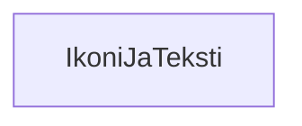

### Tehtäväsarja 7: Tehtävä 7 - `teht13`-kansio - ikoni-ja-teksti -komponentti

**muokattavien tiedostojen ja kansioiden nimet:** 

* tiedosto: `teht13/ikoni-ja-teksti.svelte` (kansiossa: `harjoitukset/02-javascript/01-svelte/teht13/ikoni-ja-teksti.svelte`)

Määritä komponentille tyylit.
