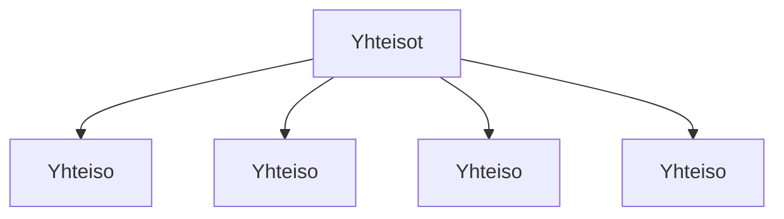

### Tehtäväsarja 7: Tehtävä 8 - `teht14`-kansio - sosiaalisen median yhteisöt

**muokattavien tiedostojen ja kansioiden nimet:** 

* tiedosto: `teht14/yhteiso.svelte` (kansiossa: `harjoitukset/02-javascript/01-svelte/teht14/yhteiso.svelte`)
* tiedosto: `teht14/yhteisot.svelte` (kansiossa: `harjoitukset/02-javascript/01-svelte/teht14/yhteisot.svelte`)

Määritä komponenteille tyylit.
