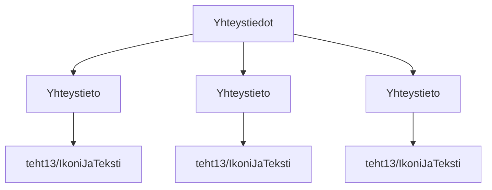

### Tehtäväsarja 7: Tehtävä 9 - `teht15`-kansio - yhteystiedot

**muokattavien tiedostojen ja kansioiden nimet:** 

* tiedosto: `teht15/yhteystieto.svelte` (kansiossa: `harjoitukset/02-javascript/01-svelte/teht15/yhteystieto.svelte`)
* tiedosto: `teht15/yhteystiedot.svelte` (kansiossa: `harjoitukset/02-javascript/01-svelte/teht15/yhteystiedot.svelte`)

Määritä komponenteille tyylit.

