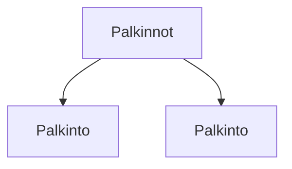

### Tehtäväsarja 7: Tehtävä 13 - `teht19`-kansio - palkinnot-listaus

"Palkinnot ja sertifikaatit" -otsikon alta löytyvä listaus.

**muokattavien tiedostojen ja kansioiden nimet:** 

* tiedosto: `teht19/palkinto.svelte` (kansiossa: `harjoitukset/02-javascript/01-svelte/teht19/palkinto.svelte`)
* tiedosto: `teht19/palkinnot.svelte` (kansiossa: `harjoitukset/02-javascript/01-svelte/teht19/palkinnot.svelte`)

Määritä komponenteille tyylit.
