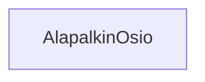

### Tehtäväsarja 7: Tehtävä 14 - `teht21`-kansio - alapalkin osio

**muokattavien tiedostojen ja kansioiden nimet:** 

* tiedosto: `teht21/alapalkin-osio.svelte` (kansiossa: `harjoitukset/02-javascript/01-svelte/teht21/alapalkin-osio.svelte`)

## Tehtävä

Määritä komponentille tyylit.
