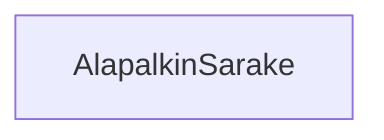

# Tehtäväsarja 7: Tehtävä 15 - `teht22`-kansio - alapalkin sarake

**muokattavien tiedostojen ja kansioiden nimet:** 

* tiedosto: `teht22/alapalkin-sarake.svelte` (kansiossa: `harjoitukset/02-javascript/01-svelte/teht22/alapalkin-sarake.svelte`)

Vastaa alapalkin sarakkeiden piirtämisestä. Keskeinen vastuualue on varmistaa, 
että viereisten sarakkeiden kanssa vie saman verran horisontaalista tilaa.

## Tehtävä

Määritä komponentille tyylit.

### Huomioita

Tarvitset luultavasti `flex: 1`-sääntöä, jotta varmistat, että jokainen sarake vie lähtökohtaisesti saman verran tilaa.