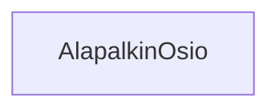

### Tehtävä 21 - alapalkin osio



**palautettavien tiedostojen ja kansioiden nimet:** 

* tiedosto: `teht21/alapalkin-osio.svelte` (kansiossa: `harjoitukset/02-javascript/01-svelte/teht21/alapalkin-osio.svelte`)

Komponentti, joka vastaa otsikon ja otsikkoa vastaavan sisällön näyttämisestä.

Saa parametrina:

* `otsikko` - sarakkeen otsikko.
* `otsikkotaso` - merkkijono - oletusarvona "h2"
* saa komponentin sisältönä (eli lapsena) osion sisällön.

Näyttää otsikon, jonka tekstiksi asettaa `otsikko`-parametrin arvon.
Otsikon elementti määräytyy `otsikkotaso`-parametrin perusteella.

Palauttaa seuraavan html:n (kun `otsikkotaso` on "h2"):

```svelte
<div class="alapalkin-osio">
  <h2 class="alapalkin-osio__otsikko">{otsikko}</h2>
  <div class="alapalkin-osio__sisältö">{sisältö}</div>
</div>
```

Tätä varten joudut kuitenkin määrittämään edelliseen esimerkkiin 
`h2`-elementin tilalle oikean elementin käyttäen `<svelte:element>`-syntaksia.

#### `svelte:element` ja elementin valinta muuttujan perusteella

Kun halutaan valita dynaamisesti html-elementti, kuten tässä tehtävässä tehdään `otsikkotaso`-muuttujan avulla,
voidaan tämä tehdä käyttäen `svelte:element`-elementtiä, joka on svelten oma työkalu tällaista tilannetta varten.

`svelte:element`-elementille annetaan `this`-attribuutti, joka saa merkkijonona sen elementin nimen, 
jonka elementin halutaan luovan.

Esimerkiksi seuraavassa svelte-koodissa määritämme dynaamisesti `div`-elementin:

```svelte
<svelte:element this={"div"}>tässä on div-elementti</svelte:element>
```

joka siis luo seuraavan html:n:

```html
<div>tässä on div-elementti</div>
```

Käytännössä tilanteet, joissa `svelte:element`-elementtiä tarvitaan ovat verrattain harvinaisia.
Yleensä voimme staattisesti määrittää suoraan haluamamme elementin nimeltä, kuten normaalisti html:ssä.

Välillä kuitenkin haluamme dynaamisesti valita myös elementin, 
kuten tässä tehtävässä, ja silloin `svelte:element` on hyödyllinen.
