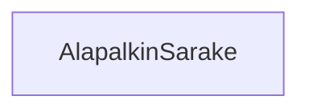

### `teht22`-kansio - alapalkin sarake



**palautettavien tiedostojen ja kansioiden nimet:** 

* tiedosto: `teht22/alapalkin-sarake.svelte` (kansiossa: `harjoitukset/02-javascript/01-svelte/teht22/alapalkin-sarake.svelte`)

Vastaa alapalkin sarakkeiden piirtämisestä. Keskeinen vastuualue on varmistaa, 
että viereisten sarakkeiden kanssa vie saman verran horisontaalista tilaa.

Saa parametrina:

* leveys - kokonaisluku - kertoo kuinka monta flex-yksikköä sarake vie tilaa. Oletusarvo: `1`.
* saa komponentin sisältönä (eli lapsena) sarakkeen sisällön.

Sarake saa tyylinä säännön `flex: {leveys};`.

Tehtävässä tarvitaan `@render`-riimua ja `children`-propia. Näistä lisää seuraavaksi.

#### elementille annetun sisällön hahmontaminen käyttäen `@render`-riimua ja `children`-proppia

Tähän mennessä on käytetty komponenteille annettavia propseja muodossa joka muistuttaa html-elementille annettavia attribuutteja.

html:

```html
<html-elementti attribuutti="attribuutin arvo" />
```

komponentti:

```svelte
<komponentti attribuutti="attribuutin arvo" />
```
