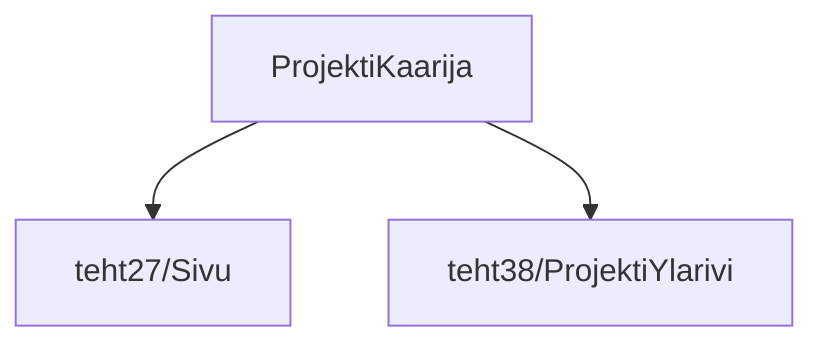

# `teht39`-kansio - projekti-sivu



Lisätään vielä projekti-yläpalkki ja sivu yhteisen komponentin sisälle. 
Kutsutaan tätä komponenttia vaikka nimellä projekti-käärijä (engl. wrapper).

**palautettavien tiedostojen ja kansioiden nimet:** 

* tiedosto: `teht39/projekti-kaarija.svelte` (kansiossa: `harjoitukset/02-javascript/01-svelte/teht39/projekti-kaarija.svelte`)

Pitää sisällään alikomponentit:

* `teht38/projekti-ylarivi.svelte`
* `teht27/sivu.svelte`

## Toteutus

_`teht39/projekti-kaarija.svelte`:_

```svelte
<script>
import ProjektiYlarivi from '../teht38/projekti-ylarivi.svelte';
import Sivu from '../teht27/sivu.svelte';
</script>

<div>
    <ProjektiYlarivi />
    <Sivu />
</div>

<style>
    /* tyylit */
</style>
```
