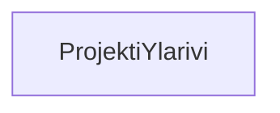

### `teht38`-kansio - projekti-ylärivi



Tämä projekti alkaa tässä vaiheessa olla toiminnallisuudeltaan sen verran näyttävä, 
että se kannattaa jo lisätä githubin puolelle osaksi omaa portfoliotasi.

Teemme tätä varten sivulle portfoliotasi varten sivun ulkopuolisen projekti-ylärivin, joka kertoo mistä tässä projektissa on kyse.

Se myös sisältää linkit github-repoon, referenssisivulle, sekä omaan github-profiiliisi.

**palautettavien tiedostojen ja kansioiden nimet:** 

* tiedosto: `teht38/projekti-ylarivi.svelte` (kansiossa: `harjoitukset/02-javascript/01-svelte/teht38/projekti-ylarivi.svelte`)

Kannattaa tehdä projekti-ylärivistäsi tyylikäs ja itsesi näköinen, mutta silti ennen kaikkea asiallinen.

Voit myös käyttää tätä projekti-yläriviä muissa portfolioosi tulevissa sivuissa.

#### Tehtävänanto

`projekti-ylärivi.svelte`-komponentti sisältää seuraavat tiedot: 

* mistä on kyse: lyhyesti (sanalla tai kahdella) ilmaise, että kyse on harjoitus-projektista - esim. "portfolio: jimms.fi -etusivu kopio" on oikein kuvaava
* linkkejä

Tärkeää on ilmaista:

* että olet toteuttamassa kopioimaasi sivua hyvin aikein,
* sivu on kopio -  et siis ole jimms.fi-sivuston alkuperäinen tekijä

Yläpalkin sisältämät linkit, ainakin:

* referenssi-linkki - osoittaa referenssisivulle 
* mahdollinen linkki muuhun referenssiaineistoon - esim. jos olet tehnyt sivun vaikka frontendpractice.com:in kautta
* repositorio-linkki - osoittaa repositorioon, josta löytyy koodi tälle sivulle.
* profiili-linkki - osoittaa omaan github-profiiliisi

##### Esimerkkitoteutus

_`projekti-ylärivi.svelte`_:

```svelte
<header>
    <h1>Harjoitus: svelte-kauppa</h1>
    
    <ul>
        <li>
            <div>referenssi:</div> 
            <a href="https://jimms.fi" />jimms.fi</a>
        </li>
        <li>
            <div>repositorio:</div> 
            <a href="..." />käyttäjätunnus/repo</a>
        </li>
        <li>
            <div>github-profiili:</div> 
            <a href="..." />käyttäjätunnus</a>
        </li>
    </ul>
</header>
```

#### Lisätehtävä

Lisää projekti-yläriviin pudotusvalikko, josta käyttäjä voi siirtyä muille portfoliosi vastaaville sivuille.