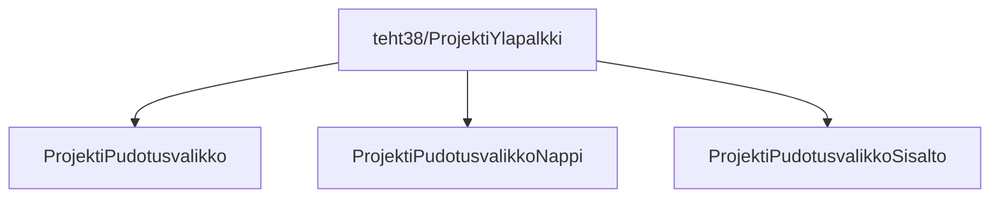

### `teht40`-kansio - projekti-pudotusvalikko

Lisätään tehtävässä 38 tehtyyn projekti-headeriin pudotusvalikko, josta löytyy napin takaa enemmän tietoa projektista.

**palautettavien tiedostojen ja kansioiden nimet:** 

* tiedosto: `teht40/projekti-pudotusvalikko.svelte` (kansiossa: `harjoitukset/02-javascript/01-svelte/teht40/projekti-pudotusvalikko.svelte`)
* tiedosto: `teht40/projekti-pudotusvalikko-nappi.svelte` (kansiossa: `harjoitukset/02-javascript/01-svelte/teht40/projekti-pudotusvalikko-nappi.svelte`)
* tiedosto: `teht40/projekti-pudotusvalikko-sisalto.svelte` (kansiossa: `harjoitukset/02-javascript/01-svelte/teht40/projekti-pudotusvalikko-sisalto.svelte`)

Voit suunnitella itse, alla mainittujen vaatimusten puitteissa, minkälaisen haluat pudotusvalikosta tehdä.

Seuraavilla sivuilla käsitellään näitä kolmea komponenttia paremmin.
